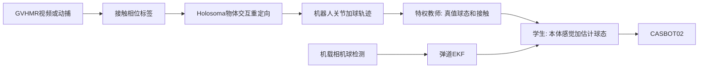

# HPB 技术架构

人形机器人打篮球（Humanoid Play Basketball）。已有外部能力是 GVHMR 到 Holosoma 再到 CASBOT 02 的视频重定向，以及 TWIST 风格的全身跟踪策略。本仓库先固定接口和技能范围，不在这里训练策略。

## 硬件约束

CASBOT 02 本体约 25 自由度：头 2、单臂 5、腰 1、单腿 6。灵巧手每只 6 个主动自由度（机械约 11）。单臂负载约 1.5 kg。篮球约 0.62 kg、直径约 24.6 cm。

单臂 5 自由度意味着腕部不构成完整球铰。手指不进入策略动作空间。v1 手部只有一种锁死的张开托球手型。

## 数据流

跟踪器沿用 TWIST：教师看未来参考帧，学生只看当前参考帧、本体感觉和球状态。参考里必须包含球的位姿。只跟踪人体关节跟踪不住运球。

Holosoma / OmniRetarget 的物体交互网格用来保持手和球的空间关系。重定向输出要对齐 [dataset.md](dataset.md)。

## 接触表示

部署策略不读接触力。接触分三层，只有运动学量进入可部署观测。

### 数据层

由球轨迹自动打标签，来源是视频球检测或仿真真值。

| 相位 | 判定 |
| --- | --- |
| `impact` | 球近手，且竖直速度突变 |
| `hold` | 球随手一起运动 |
| `flight` | 离开手后符合重力抛物线 |
| `free` | 其余情况，包括静止在地上 |

近手阈值、速度突变阈值和抛物线残差阈值在标注脚本里固定，并写入样本的 `label_params`，避免各技能各写一套。

### 训练层

只存在于仿真，供奖励和 critic 使用：物理引擎给出的接触点、法向、冲量。

奖励对齐 SkillMimic 的统一模仿，四项相乘而不是各写一套技能奖励：

- 身体跟踪：根状态与关节相对参考
- 球轨迹跟踪：球位置与速度相对参考
- 手相对球的位置
- 接触图是否与参考相位一致

Critic 看真值球态和接触。Actor 不看这些量。

### 部署观测

Actor 的球相关观测只有：

- 基座坐标系下的球位置、线速度
- 手相对球的向量（左右手各一份；手型锁死，用掌心参考点）
- 弹道模型给出的预计触球时间与落点

不包含指尖力，也不包含逐连杆接触标志。

本体感觉与现有 TWIST 学生一致：关节位置与速度、根姿态、根速度，以及当前一帧参考（关节目标加该帧球状态）。运球技能额外带一个节律相位 `phase`，范围 `[0, 1)`。

## 视觉

不从图像端到端学控制。仿真用真值球状态训练；实机用独立检测器输出同一向量。这与 DribbleBot 相同，也和 TWIST 学生策略的观测接口兼容。

- 拣球、定点投篮：场地标定或外部相机。篮筐位姿在 L5 之前当作常量。
- 运球：头或胸前相机检测橙色球，用已知直径把检测框换成距离，再用重力弹道 EKF 补速度。自由飞行段信任动力学，接触附近信任检测。
- 训练时对球状态加位置噪声、速度噪声和 50–100 ms 延迟，使学生能接受实机检测。
- 图像不进入 PPO。

检测器输出必须能填进部署观测里的球位置和速度。EKF 在检测丢失的飞行段外推，超时则把该帧标为无效，策略走持球或停球的安全动作，而不是沿用过期速度。

## 无触觉预判

人可以不看球运球，靠的是节律前馈、触觉和本体感觉。撞击大约十几毫秒，相机和策略都来不及在撞击瞬间闭环。没有皮肤触觉时，用下面三件事代替触感：

1. 两次接触之间，球是已知重力下的抛物线。看见弹出方向后，提前约 100–300 ms 预测下一次落点，用来修正下一次推球。
2. 手腕、肘关节电流或力矩残差，加上 IMU 冲击，当作二元「打到了」事件，把节律相位拉回。这和足式机器人无足底传感器估计触地同一思路。该事件不提供接触点位置。
3. 运球策略输出周期性手臂动作，而不是对每次撞击做反应。域随机化包括球的质量、恢复系数、摩擦和观测延迟。

第一版运球仍然要看见球，但只需要断续看见飞行段，不需要盯着撞击瞬间。

## 固定手型

v1 唯一手部策略：一种张开托球手型，掌心微凹，指间距大于球，全程锁死，不进动作空间。

- 拣球、持球、接球用双手笼架，球贴躯干，不靠单手捏取。
- 传球用双手前推。
- 投篮用推射加已有的腕俯仰。后旋和拨指不在 v1。
- 掌心加软垫。接球时降低手臂阻抗，避免刚性手指把球弹飞。
- 单臂负载 1.5 kg，静态持球重量足够。运球冲击是否顶满关节力矩，留到有 URDF/MJCF 的仿真阶段检查。

若硬件手必须给一个开合指令，该指令只在技能切换时写一次，不放进 50 Hz 策略。

## 技能阶梯

每级复用上一节的球状态接口。低层未稳定前不开始高层。

| 等级 | 技能 | 完成标准 |
| --- | --- | --- |
| L0 | 仿真场景 | CASBOT 02、篮球刚体、篮筐；固定手；球状态观测可读取 |
| L1 | 主动拣球 | 球静止在地上；看见球，走过去，双手抄起并抱稳。第一项要训练的技能 |
| L2 | 持球行走 | 抱球移动，球不脱落 |
| L3 | 运球 | 先原地，再走路；节律相位可被冲击事件复位 |
| L4 | 传球 | 双手把球推到固定目标区域 |
| L5 | 定点推射 | 参考动作加残差；篮筐位姿已知；难点是出手时机 |
| L6 | 接球 | 来球轨迹已知或由 EKF 估计，双手笼架接住 |
| L7+ | 1v1、2v2、3v3 | 高层在拣、运、传、投之间切换，不是一个更大的模仿策略 |

1v1 及以后的对手和队友是高层的输入，不改变低层观测定义。

## 当前不做

- 不训练教师或学生策略。
- 不搭建 Isaac / MuJoCo 环境。
- 不接入实机相机。
- 不把指尖自由度放进动作空间。

仿真环境、拣球奖励和实机视觉等 CASBOT 02 的 URDF/MJCF 进入仓库后再做。
